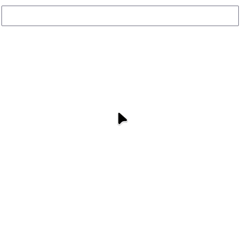

# React Autocomplete App


React autocomplete app created in educational purposes.



## Table of contents

* [Description](#description)
* [Installation](#installation)
* [Usage](#usage)
* [Contributing](#contributing)
* [Credits](#credits)
* [License](#license)

----

## Description

This is React Autocomplete app. It implements users' emails autocomplete. Project created in education purposes.

## Installation

### Dependencies:

* [npm](https://www.npmjs.com/)

```shell
# Clone repo
git clone https://github.com/1mpossible-code/react-autocomplete
# Cd in it
cd react-autocomplete
# Install packages
npm install
# Run application
npm start
```

> You will have server on http://localhost:3000/

## Usage

Use cursor to select input field. You can type the part of user's email and app may suggest what email do you mean. 

To autocomplete email click on the suggestion. To hide suggestions click past the input field. 

Emails are:

`george.bluth@reqres.in`,

`janet.weaver@reqres.in`,

`emma.wong@reqres.in`,

`eve.holt@reqres.in`,

`charles.morris@reqres.in`,

`tracey.ramos@reqres.in`.

## Contributing

Feel freely to contribute this project. [Issues](https://github.com/1mpossible-code/react-autocomplete/issues)
and [PRs](https://github.com/1mpossible-code/react-autocomplete/pulls) are welcome!

## Credits

You can mail to `linme00p@gmail.com` to contact the author

# License

Copyright © 2021 [1mpossible-code](https://github.com/1mpossible-code). This project
is [GPLv3](https://www.https://www.gnu.org/licenses/gpl-3.0.htmlgnu.org/licenses/gpl-3.0) licensed.
